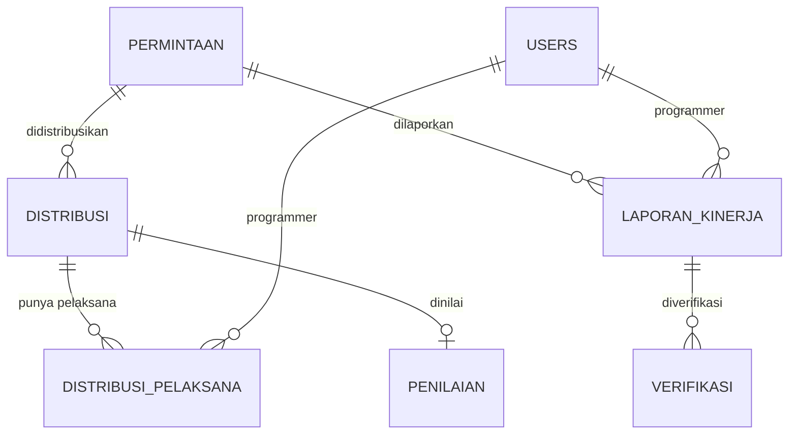
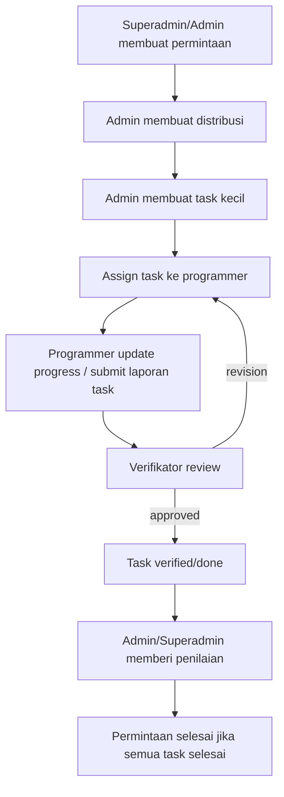

# Report Alur Tugas, Penugasan, dan Gap Fitur

Tanggal scan: 2026-05-16  
Scope: schema/migration, route, handler, service, repository untuk alur `permintaan`, `distribusi`, `pelaksana`, `laporan`, `verifikasi`, dan migration `penilaian`.

## Ringkasan

Kebingungan utamanya valid: di project ini belum ada entity `penugasan` atau `task` yang benar-benar merepresentasikan “task kecil-kecil”. Yang ada sekarang adalah:

- `permintaan`: kebutuhan awal dari pemda/aplikasi.
- `distribusi`: catatan admin saat mendistribusikan satu permintaan.
- `distribusi_pelaksana`: tabel pivot untuk menunjuk programmer pada distribusi.
- `laporan_kinerja`: laporan progress programmer, tapi relasinya langsung ke `permintaan`, bukan ke `distribusi`, `distribusi_pelaksana`, atau task.
- `verifikasi`: verifikasi atas `laporan_kinerja`.
- `penilaian`: migration sudah ada, tapi belum ada module Go/route/service/repository yang memakai tabel ini.

Jadi alur target:

```text
superadmin buat permintaan
-> admin breakdown menjadi task kecil-kecil
-> programmer mengerjakan task
-> verifikator memverifikasi hasil task
-> admin/superadmin menilai ketepatan waktu dan keberhasilan
```

belum bisa dimodelkan dengan rapi. Saat ini sistem baru mendekati:

```text
superadmin/admin buat permintaan
-> admin buat distribusi dan memilih programmer
-> programmer membuat laporan untuk permintaan
-> verifikator membuat/mengubah verifikasi atas laporan
```

Bagian yang hilang paling besar adalah **tabel task/penugasan sebagai unit kerja kecil**.

## Model Saat Ini

### Tabel inti yang sudah ada

- `permintaan`: dibuat dari migration `migrations/000005_create_permintaan_table.up.sql`.
- `distribusi`: punya `permintaan_id`, `admin_id`, `komentar`; lihat `migrations/000006_create_distribusi_table.up.sql:1-8`.
- `distribusi_pelaksana`: pivot `distribusi_id` dan `programmer_id`; lihat `migrations/000007_create_distribusi_pelaksana_table.up.sql:1-8`.
- `laporan_kinerja`: punya `permintaan_id` dan `programmer_id`; lihat `migrations/000008_create_laporan_kinerja_table.up.sql:1-11`.
- `verifikasi`: punya `laporan_id` dan `verifikator_id`; lihat `migrations/000009_create_verifikasi_table.up.sql:1-10`.
- `progress_history`: menyimpan perubahan progress laporan; lihat `migrations/000018_create_progress_history_table.up.sql`.
- `penilaian`: migration untracked sudah ada di `migrations/000022_create_penilaian_table.up.sql:1-12`.

### Relasi aktual



Masalah dari relasi aktual: `laporan_kinerja` tidak tahu laporan itu untuk distribusi/task yang mana. Ia hanya tahu `permintaan_id` dan `programmer_id`.

## Gap Terhadap Alur Ideal

### 1. Tidak ada tabel task/penugasan sebagai unit kerja kecil

Yang disebut “penugasan” di code saat ini kemungkinan besar adalah `distribusi_pelaksana`. Namun tabel ini hanya menyimpan:

- `distribusi_id`
- `programmer_id`
- `is_read`
- timestamp

Tabel ini tidak punya:

- judul task
- deskripsi task
- output/acceptance criteria
- deadline task
- prioritas
- status task
- estimasi
- urutan task
- reviewer/verifikator
- tanggal mulai/selesai

Akibatnya admin belum bisa “breakdown menjadi task kecil-kecil”. Admin hanya bisa memilih beberapa programmer untuk satu distribusi.

Rekomendasi:

- Tambahkan tabel `tasks` atau `penugasan`.
- Jangan pakai `distribusi_pelaksana` sebagai task, karena secara desain ia lebih cocok sebagai pivot assignment.

Contoh schema awal:

```sql
CREATE TABLE tasks (
  id UUID PRIMARY KEY DEFAULT gen_random_uuid(),
  permintaan_id UUID NOT NULL REFERENCES permintaan(id) ON DELETE CASCADE,
  distribusi_id UUID REFERENCES distribusi(id) ON DELETE SET NULL,
  created_by UUID NOT NULL REFERENCES users(id),
  assigned_to UUID REFERENCES users(id),
  title VARCHAR(255) NOT NULL,
  description TEXT NOT NULL,
  acceptance_criteria TEXT,
  priority VARCHAR(20) NOT NULL DEFAULT 'normal'
    CHECK (priority IN ('low', 'normal', 'high', 'urgent')),
  status VARCHAR(30) NOT NULL DEFAULT 'todo'
    CHECK (status IN ('todo', 'in_progress', 'submitted', 'revision', 'verified', 'done', 'cancelled')),
  start_date DATE,
  due_date DATE,
  completed_at TIMESTAMPTZ,
  created_at TIMESTAMPTZ NOT NULL DEFAULT NOW(),
  updated_at TIMESTAMPTZ NOT NULL DEFAULT NOW()
);
```

### 2. `laporan_kinerja` belum terhubung ke task/distribusi

Lokasi:

- `migrations/000008_create_laporan_kinerja_table.up.sql:1-11`
- `internal/laporan/repository.go:483-503`

Saat programmer membuat laporan, data yang disimpan hanya `permintaan_id`, `programmer_id`, `laporan_progress`, `status`, dan `lampiran`. Tidak ada `task_id` atau `distribusi_id`.

Edge case:

- Satu permintaan punya 5 task, programmer mengirim laporan. Sistem tidak tahu laporan itu untuk task yang mana.
- Dua programmer mengerjakan task berbeda di permintaan yang sama. Laporan mereka bercampur di level permintaan.
- Admin/verifikator tidak bisa menilai task spesifik yang selesai atau belum.

Rekomendasi:

- Jika menambah tabel `tasks`, ubah `laporan_kinerja` agar punya `task_id`.
- Jika tetap memakai `distribusi` sebagai task, minimal tambahkan `distribusi_id` ke `laporan_kinerja`.
- Lebih ideal: `laporan_kinerja.task_id NOT NULL REFERENCES tasks(id)`.

### 3. Programmer bisa membuat laporan untuk permintaan yang belum tentu ditugaskan kepadanya

Lokasi:

- Route laporan mengizinkan role `programmer`: `routes/routes.go:109-121`.
- Create laporan menerima `permintaan_id`: `internal/laporan/dto.go:10-14`.
- Service langsung insert laporan dengan user login sebagai programmer: `internal/laporan/service.go:27-40`.

Belum ada validasi bahwa programmer login memang ada di `distribusi_pelaksana` untuk permintaan tersebut.

Edge case:

- Programmer A tahu `permintaan_id` milik programmer B, lalu membuat laporan di permintaan itu.
- Programmer membuat laporan sebelum admin mendistribusikan tugas.

Rekomendasi:

- Saat create laporan, cek assignment:
  - Jika memakai model sekarang: cek ada `distribusi` untuk `permintaan_id` dan `distribusi_pelaksana.programmer_id = userID`.
  - Jika memakai `tasks`: cek `tasks.assigned_to = userID`.

### 4. Verifikasi belum jelas berbasis laporan atau task

Lokasi:

- `verifikasi` mengarah ke `laporan_id`: `migrations/000009_create_verifikasi_table.up.sql:3`.
- Verifikator bisa CRUD via `/verifikasi`: `routes/routes.go:128-136`.
- Ada juga endpoint create verifikasi di group `/laporan`: `routes/routes.go:117`.

Masalah:

- Jika laporan tidak terikat ke task, verifikasi juga tidak bisa memastikan task mana yang dinyatakan benar.
- `POST /laporan/verif/:laporan_id` berada di group yang mengizinkan `programmer` dan `verifikator`; lihat `routes/routes.go:109-121`. Ini berisiko programmer membuat record verifikasi untuk laporannya sendiri.
- `CreateVerifikasiService` di package laporan memakai field bernama `ProgrammerID`, tetapi dipakai sebagai `verifikator_id` saat insert; lihat `internal/laporan/service.go:61-68` dan `internal/laporan/repository.go:528-546`.

Rekomendasi:

- Hapus atau batasi endpoint `POST /laporan/verif/:laporan_id` hanya untuk `verifikator`.
- Jadikan verifikasi sebagai bagian dari lifecycle task:
  - programmer submit task
  - verifikator approve/revision
  - status task berubah ke `verified` atau `revision`
- Tambahkan validasi bahwa verifikator boleh memverifikasi task/laporan tersebut.

### 5. Penilaian sudah ada migration, tapi belum ada fitur aplikasi

Lokasi:

- `migrations/000022_create_penilaian_table.up.sql:1-12`
- Tidak ada package `internal/penilaian`.
- Tidak ada route `/penilaian` di `routes/routes.go`.

Tabel `penilaian` menyimpan `distribusi_id`, `penilai_id`, `tingkat_keberhasilan`, `ketepatan_waktu`, `komentar`, `tanggal_selesai`. Ini belum bisa dipakai karena belum ada handler/service/repository.

Catatan desain:

- `UNIQUE(distribusi_id)` berarti satu distribusi hanya bisa punya satu penilaian.
- Jika satu distribusi punya banyak programmer atau banyak task, nilai tidak bisa spesifik ke programmer/task.
- Ketepatan waktu disimpan manual sebagai enum, belum dihitung otomatis dari deadline vs tanggal selesai.

Rekomendasi:

- Jika penilaian ingin per task: `penilaian.task_id UNIQUE`.
- Jika penilaian ingin per programmer dalam satu permintaan: pakai `penilaian.task_id` atau `penilaian.distribusi_pelaksana_id`.
- Simpan juga nilai terhitung:
  - `due_date`
  - `submitted_at`
  - `verified_at`
  - `completed_at`
  - `delay_days`
- Batasi role pembuat penilaian ke `admin` dan `super_admin`.

### 6. Status tersebar dan belum menjadi state machine

Status saat ini:

- `permintaan.status`: `proses`, `selesai`, `revisi`.
- `laporan_kinerja.status`: `putih`, `merah`, `orange`, `kuning`, `hijau`.
- `verifikasi.status_verified`: `pending`, `approved`, `revision`.
- `distribusi_pelaksana.is_read`: notifikasi dibaca/belum.
- `tasks.status`: belum ada.

Risiko:

- Permintaan bisa `selesai` walaupun task/laporan belum approved.
- Laporan bisa `hijau` tetapi verifikasi masih `pending`.
- Verifikasi `approved` tidak otomatis membuat permintaan selesai secara aman.

Rekomendasi:

- Tetapkan state machine.
- Status parent dihitung dari child:
  - `permintaan` selesai jika semua task `done`.
  - task `done` jika laporan terakhir approved dan sudah dinilai atau tidak perlu dinilai.
  - distribusi selesai jika semua task dalam distribusi selesai.

## Alur Target yang Disarankan

### Versi yang paling rapi



### Tabel minimal yang perlu ditambah/diubah

1. `tasks`
   - Unit kerja kecil.
   - Relasi ke `permintaan`, optional `distribusi`.
   - Assigned ke programmer.

2. `task_reports` atau ubah `laporan_kinerja`
   - Relasi ke `task_id`.
   - Bisa menyimpan banyak update progress per task.

3. `task_verifications` atau ubah `verifikasi`
   - Relasi ke `task_report_id` atau `task_id`.
   - Menyimpan reviewer, status, komentar.

4. `penilaian`
   - Relasi sebaiknya ke `task_id` atau `task_report_id`, bukan hanya `distribusi_id`.
   - Bisa agregasi ke permintaan untuk dashboard.

5. Optional `task_status_history`
   - Audit trail status task.

## Edge Case yang Mungkin Muncul

### Assignment dan task

- Admin membuat distribusi tanpa pelaksana. Saat ini dicegah via validasi `ValidatePelaksana`, tetapi create distribusi dan insert pelaksana belum transaksi.
- Admin update distribusi, pelaksana lama dihapus, insert pelaksana baru gagal. Assignment bisa kosong.
- Programmer dihapus/nonaktif, tetapi masih punya task/laporan berjalan.
- Satu programmer diassign ke banyak task dengan deadline bentrok.
- Task dipindahkan ke programmer lain setelah laporan dibuat. Perlu aturan apakah laporan lama tetap milik programmer lama.

### Laporan

- Programmer membuat laporan untuk permintaan yang bukan tugasnya.
- Programmer update laporan setelah verifikasi approved.
- Banyak laporan untuk permintaan yang sama membuat “latest progress” ambigu.
- `progress_history` tidak membedakan perubahan status yang valid dan tidak valid.
- Upload lampiran laporan saat ini memakai tabel salah `laporan_progress`, bukan `laporan_kinerja`; lihat `internal/laporan/repository.go:597-599`.

### Verifikasi

- Verifikator membuat banyak verifikasi untuk laporan yang sama karena tidak ada unique constraint.
- Programmer bisa memakai endpoint `/laporan/verif/:laporan_id` jika route ini tetap di group laporan.
- Status laporan bisa berubah dari update verifikasi, tetapi operasi update verifikasi dan update laporan belum transaksi.
- Tidak ada aturan komentar wajib ketika status `revision`.

### Penilaian

- Penilaian dibuat sebelum verifikasi approved.
- Penilaian dibuat untuk distribusi yang punya beberapa programmer, sehingga nilai tidak jelas untuk siapa.
- `ketepatan_waktu` diinput manual, bisa tidak sesuai deadline.
- `tanggal_selesai` bisa sebelum tanggal mulai/deadline/pembuatan.
- Tidak ada pencegahan admin menilai task yang bukan area tanggung jawabnya.

### Lifecycle permintaan

- Permintaan dihapus, child ikut terhapus karena cascade. Ini mungkin tidak cocok kalau butuh audit.
- Permintaan di-archive saat masih ada task aktif.
- Permintaan status `selesai`, tetapi masih ada verifikasi `revision`.
- Deadline permintaan berubah setelah task dibuat. Perlu aturan apakah deadline task ikut berubah.

## Bug dan Risiko Implementasi yang Terlihat

### 1. Tidak ada transaksi untuk operasi multi-step

Lokasi:

- `internal/distribusi/service.go:18-26`
- `internal/distribusi/service.go:62-70`
- `internal/laporan/service.go:37-53`
- `internal/laporan/service.go:116-142`
- `internal/verifikasi/repository.go:234-279`

Dampak:

- Data parent berhasil dibuat tetapi child gagal.
- Status laporan berubah sebagian.
- History/verifikasi bisa tidak sinkron.

### 2. Handler mengatakan duplicate conflict, tetapi constraint belum ada

Contoh:

- `distribusi` handler punya pesan conflict “Data distribusi untuk permintaan ini sudah ada”, tetapi migration `distribusi` tidak punya `UNIQUE(permintaan_id)`.
- `laporan` handler punya pesan conflict “Data laporan untuk permintaan ini sudah ada”, tetapi migration `laporan_kinerja` tidak punya unique untuk `permintaan_id`, `programmer_id`, atau kombinasi lain.

Ini perlu diputuskan:

- Jika satu permintaan hanya boleh satu distribusi, tambah unique.
- Jika satu permintaan boleh banyak task/distribusi, ubah pesan error dan model data.
- Jika satu programmer boleh banyak laporan progress, jangan pakai pesan “sudah ada”.

### 3. Access control berbasis relasi belum cukup

Role middleware hanya cek role dari token; lihat `internal/middle_ware/role_middlleware.go:9-37`. Belum ada validasi ownership/assignment di banyak endpoint.

Risiko:

- Programmer fetch detail laporan milik programmer lain jika tahu ID.
- Programmer membuat laporan untuk permintaan yang bukan assignment-nya.
- Programmer/verifikator membuat komentar di data yang tidak terkait dengannya.

### 4. Penilaian belum tersambung ke aplikasi

Migration `penilaian` ada, tapi tidak ada:

- DTO
- model
- repository
- service
- handler
- route
- swagger
- validasi role
- validasi status selesai/approved

### 5. `laporan_kinerja` tidak punya relasi ke distribusi/task

Ini bug desain paling berpengaruh untuk alur tugas. Selama laporan hanya menempel ke `permintaan`, sistem tidak bisa menjawab:

- task mana yang dikerjakan?
- distribusi mana yang sedang dilaporkan?
- programmer ini mengerjakan bagian apa?
- verifikasi ini meng-approve task yang mana?
- nilai keberhasilan ini untuk output yang mana?

## Rekomendasi Roadmap

### Phase 1: Rapikan konsep

1. Putuskan istilah:
   - `permintaan` = kebutuhan/request utama.
   - `distribusi` = batch assignment dari admin.
   - `task` atau `penugasan` = unit kerja kecil.
   - `pelaksana` = assignment programmer ke task/distribusi.
2. Tambahkan dokumen state machine status.
3. Tentukan apakah laporan dan verifikasi per task atau per permintaan. Untuk alur yang kamu mau, sebaiknya per task.

### Phase 2: Tambah tabel task

1. Buat migration `tasks`.
2. Tambah `task_id` ke `laporan_kinerja`.
3. Tambah index untuk `tasks.permintaan_id`, `tasks.assigned_to`, `tasks.status`, `tasks.due_date`.
4. Tambah endpoint:
   - `POST /permintaan/:id/tasks`
   - `GET /tasks`
   - `GET /tasks/:id`
   - `PATCH /tasks/:id`
   - `PATCH /tasks/:id/status`

### Phase 3: Kunci validasi alur

1. Programmer hanya bisa membuat laporan untuk task miliknya.
2. Laporan tidak bisa diubah setelah task approved/done kecuali status revision.
3. Verifikator hanya bisa review task yang sudah submitted.
4. Admin/superadmin hanya bisa menilai task yang sudah approved atau done.
5. Permintaan selesai otomatis bila semua task selesai.

### Phase 4: Implementasi penilaian

1. Tambahkan package `internal/penilaian`.
2. Relasikan penilaian ke `task_id`.
3. Hitung ketepatan waktu dari `completed_at` vs `due_date`, bukan input manual saja.
4. Buat agregasi nilai di dashboard:
   - rata-rata keberhasilan per permintaan
   - jumlah task tepat waktu/terlambat
   - task revision rate
   - lead time dari dibuat sampai verified/done

## Kesimpulan

Yang kurang dari project ini bukan sekadar “tabel penugasan”, tapi **unit kerja yang menjadi pusat alur**. Saat ini `permintaan` terlalu besar, `distribusi_pelaksana` terlalu tipis, dan `laporan_kinerja` langsung menempel ke `permintaan`. Untuk alur yang kamu inginkan, perlu tambah entity `task/penugasan`, lalu laporan, verifikasi, dan penilaian harus mengarah ke entity itu.

